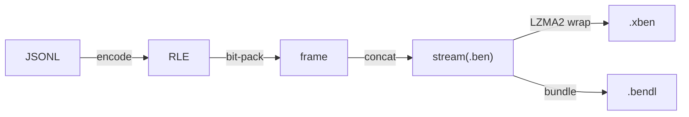

# Context

Orientation for anyone (human or agent) landing in the `binary-ensemble` workspace. It explains what
the project is, how the code is shaped, and the invariants that aren't obvious from any single file.

## What this project is

`binary-ensemble` compresses **ensembles of districting plans**. A redistricting sampler (MCMC
ReCom, SMC, etc.) emits thousands to millions of plans as canonicalized JSONL: one
`{"assignment": [...], "sample": n}` line per draw. Those files are enormous and highly redundant.
This workspace turns them into compact binary formats and provides the tooling to encode, decode,
inspect, relabel, and bundle them.

It is the spiritual successor to [PCompress](https://github.com/mggg/pcompress) and interoperates
with it.

The formats, in increasing capability:

- **`.ben`**: a banner plus bit-packed, run-length-encoded frames. One frame per sample.
- **`.xben`**: a BEN stream's payload wrapped in LZMA2 for maximum size reduction.
- **`.bendl`**: a self-describing _bundle_ holding a header, optional assets (dual graph, metadata,
  node-permutation map), an embedded BEN/XBEN assignment stream, and a trailing directory. Feels
  like one file; supports interrupted writes and post-finalize appends.

## Domain model (in brief)

`docs/glossary.md` is the **source of truth** for terminology and is worth reading before making
changes. The essentials:

- **Plan**: a partition of dual-graph nodes into districts (the mathematical object).
  **Assignment**: its vector encoding, `Vec<u16>` where index _i_ is the district id of node _i_.
  One plan has many assignments.
- **Sample**: `(sample_number, assignment)`. **Ensemble**: an ordered stream of samples from one
  sampler run; the thing every format wraps.
- **Variant**: `Standard` | `MkvChain` | `TwoDelta`. Fixed per stream by its banner. `Standard`
  stores each sample independently; `MkvChain` collapses repeated consecutive samples with a count;
  `TwoDelta` delta-encodes single-ReCom-step transitions. Variant fitness depends on the sampler;
  see the glossary.
- **Dual graph**: the geographic adjacency graph that gives a node ordering meaning.
  Relabeling/reordering operations are defined against it.

The glossary also nails down deliberately-disambiguated words ("header", "extract", "payload",
"canonical\*") and the relabeling taxonomy. Honor those distinctions in code and prose.

## Architecture

A Cargo workspace with two members:

- **`ben/`**: package `binary-ensemble`, library `binary_ensemble`, plus two thin CLI binaries.
- **`ben-py/`**: PyO3 bindings (cdylib) published as the `binary_ensemble` Python package. Depends
  on `ben/` by path; the core library has no Python dependency.

### CLI binaries (`ben/src/bin/*.rs`)

Each is a one-line wrapper over `cli::<tool>::run()`. `ben` is a subcommand tree; `bendl` owns the
bundle container role:

| Binary | Role | Does | | ------- | -------- |
------------------------------------------------------------------------- | | `ben` | codec |
encode/decode BEN/XBEN + xz; relabel/canonicalize/reencode; pcompress bridge | | `bendl` | bundle |
create / inspect / extract / append `.bendl` containers |

`ben` subcommands: `encode`, `xencode`, `decode`, `xdecode`, `lookup`, `xz-compress`,
`xz-decompress`, `relabel`, `canonicalize`, `reencode`, `sort-graph`, and `pcompress` (`from-ben` /
`to-ben` / `to-xben`). The relabel pipeline (decode → transform → re-encode) backs
`relabel`/`canonicalize`/`reencode`; the PCompress bridge backs `pcompress`.

### Library modules (`ben/src/`)

- **`codec/`**: the heart. `encode`, `decode`, `frames` (`BenEncodeFrame` / `BenDecodeFrame`), and
  `translate` (BEN ↔ ben32 wire form). Frames keep their `raw_bytes` so they can be moved/subsampled
  without eager unpacking.
- **`io/`**: streaming `reader` / `writer` over buffered, generic IO, and `bundle` (the `.bendl`
  reader/writer/verify/format machinery).
- **`format/`**: on-disk metadata shared across streams (banners and `FormatError`).
- **`ops/`**: the higher-level operations `relabel` (the single `relabel_ben_file` driver
  parameterised by `RelabelOptions`) and `extract`.
- **`json/`**: dual-graph utilities (NetworkX-adjacency IO, MLC and RCM node-ordering algorithms)
  used by the relabel pipeline.
- **`progress/`**, **`logging/`**, **`util/`**: spinners (`indicatif`), `tracing` setup, and small
  shared helpers (RLE).

### Data flow

Decode reverses this. The relabel subcommands run decode → transform → re-encode in one streaming
pass. The encoding stack has five named layers (bit-packing, RLE, frame, stream, container); see the
glossary's "Encoding Stack" table.

## Invariants and cross-cutting concerns

These hold across the codebase and are easy to violate by accident:

- **Format stability is a contract.** Committed fixtures under `ben/tests/fixtures/v<n>/` must keep
  decoding forever within a major version. Never regenerate fixtures in place. See
  `docs/format-stability.md`.
- **Frames decode lazily.** Keeping `raw_bytes` without unpacking runs is what makes
  subsample-by-skip and random-access reads fast. Don't force eager bit-unpacking on read.
- **Integrity is checked with CRC32C.** Verifying read paths are the default; checksum-skipping
  variants are explicitly named with an `_unverified` suffix.
- **Terminology is disciplined.** The glossary governs identifiers and prose; when they disagree,
  the glossary wins and the code changes.
- **Streaming, not slurping.** Ensembles are too large to hold in memory.
- **64-bit only** (enforced with `compile_error!` in `lib.rs`).
- **Illegal states are unrepresentable where practical**: e.g. `XBenVariant` cannot hold `TwoDelta`,
  so BEN32-only paths reject it at compile time.

## Building and testing

The workspace uses a `Taskfile.yml` (the `task` / `go-task` runner) as the single entry point for
local workflows. CI runs the lightweight gates (formatting + lints) on every PR; the heavy gates
(full test suites, big-endian emulation) run on demand via the Actions tab or a `/ci-full` /
`/ci-endian` PR comment from a collaborator. The wheel-publishing workflow is separate and
tag-triggered.

- `task test`: Rust fast suite + `#[ignore]`-gated slow/stress suite + Python `pytest`.
- `task format`: `cargo fmt --all` + `ruff format`.
- `task lint`: `cargo clippy --workspace --all-targets` (warnings denied) + `ruff check`.
- `task coverage-summary`: combined Rust + Python coverage.
- `task test-endian`: full ben suite on one big-endian and one little-endian target via `cross`
  (Docker + QEMU), proving wire-format endianness regardless of the development machine.
  `task check-endian` is the no-Docker compile-only tier.
- `task fuzz`: time-boxed coverage-guided fuzzing (cargo-fuzz/libFuzzer, nightly) of every read
  surface, seeded from the committed fixtures. `FUZZ_SECONDS` bounds each target (default 60).

Python development uses `uv` + `maturin` (`task ben-py-develop`).

## Document map

- **`docs/glossary.md`**: terminology, the source of truth.
- **`docs/coding-standards.md`**: how code in this repo is written (errors, logging, naming,
  testing, modules, PyO3).
- **`docs/bendl-format-spec.md`**: the `.bendl` on-disk binary layout.
- **`docs/format-stability.md`**: the wire-format stability policy.
- **`README.md`**: user-facing CLI and library usage.
- **`docs/*-plan.md`**: active design plans, written before implementation.
